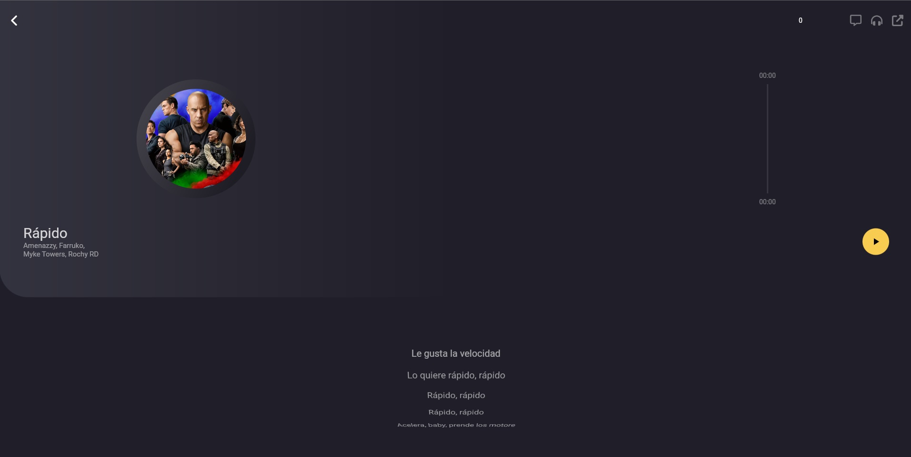

# Music player app

This is a music player app that plays music from the local storage.
It is also a fully responsive design.

To achieve this, it makes use of the following packages:

- Animations
- Provider
- Assets audio player

  
  

